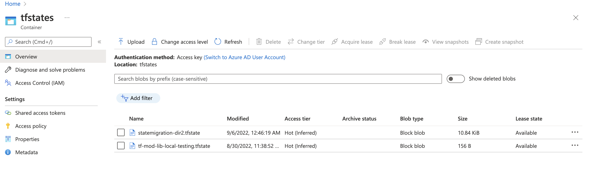

- [Tutorial : How to migrate terraform state ?](#tutorial--how-to-migrate-terraform-state-)
  - [Moving State file from remote file to another remote **empty** file.](#moving-state-file-from-remote-file-to-another-remote-empty-file)
    - [Initial Backend Configuration](#initial-backend-configuration)
    - [First Terraform apply after resource definition. [ Old State ]](#first-terraform-apply-after-resource-definition--old-state-)
    - [Pull Terraform State](#pull-terraform-state)
      - [To verify if the remote state is still in use.](#to-verify-if-the-remote-state-is-still-in-use)
    - [Update the new backend configuration.](#update-the-new-backend-configuration)
      - [Init with `-reconfigure` flag.](#init-with--reconfigure-flag)
    - [Move Local Pulled State to New State.](#move-local-pulled-state-to-new-state)
    - [Verify if the resources are still available with new state file.](#verify-if-the-resources-are-still-available-with-new-state-file)
    - [Clean up local and Old State File.](#clean-up-local-and-old-state-file)

# Tutorial : How to migrate terraform state ?

In this tutorial I have used azurerm storage account as a remote backend, however it should be same in other hyperscaler or other backend. Please refer to respective backend configuration documentation.

## Moving State file from remote file to another remote **empty** file.

#### Initial Backend Configuration

```hcl
terraform {
  required_providers {
    azurerm = {
      source  = "hashicorp/azurerm"
      version = "~>3.21"
    }
  }
  backend "azurerm" {
    resource_group_name  = "resource_group_with_storage_account"
    storage_account_name = "uniquestorageaccount"
    container_name       = "tfstates"
    key                  = "statemigration-dir1.tfstate"
  }
}
```

#### First Terraform apply after resource definition. [ Old State ]

```hcl
Plan: 4 to add, 0 to change, 0 to destroy.

Changes to Outputs:
  + rg_name  = "state-migration"
  + vpc_name = "vnet-state-migration"
azurerm_resource_group.this: Creating...
azurerm_resource_group.this: Creation complete after 1s [id=/subscriptions/xxxxxxxxx-xxxx-4c3d-b7ae-xxxxxxxxx/resourceGroups/state-migration]
azurerm_network_security_group.this: Creating...
azurerm_storage_account.this: Creating...
azurerm_network_security_group.this: Creation complete after 5s [id=/subscriptions/xxxxxxxxx-xxxx-4c3d-b7ae-xxxxxxxxx/resourceGroups/state-migration/providers/Microsoft.Network/networkSecurityGroups/sg-state-migration]
azurerm_virtual_network.this: Creating...
azurerm_storage_account.this: Still creating... [10s elapsed]
azurerm_virtual_network.this: Creation complete after 5s [id=/subscriptions/xxxxxxxxx-xxxx-4c3d-b7ae-xxxxxxxxx/resourceGroups/state-migration/providers/Microsoft.Network/virtualNetworks/vnet-state-migration]
azurerm_storage_account.this: Still creating... [20s elapsed]
azurerm_storage_account.this: Creation complete after 28s [id=/subscriptions/xxxxxxxxx-xxxx-4c3d-b7ae-xxxxxxxxx/resourceGroups/state-migration/providers/Microsoft.Storage/storageAccounts/stmigrstgacct]

Apply complete! Resources: 4 added, 0 changed, 0 destroyed.

Outputs:

rg_name = "state-migration"
vpc_name = "vnet-state-migration"
```

#### Pull Terraform State

```bash
terraform state pull > local.tfstate
```

- It will pull the remote state file locally under `local.tfstate` file.

##### To verify if the remote state is still in use.

```bash
➜  terraform-state-migration git:(docs/state-migrate) ✗ tf plan
azurerm_resource_group.this: Refreshing state... [id=/subscriptions/xxxxxxxxx-xxxx-4c3d-b7ae-xxxxxxxxx/resourceGroups/state-migration]
azurerm_network_security_group.this: Refreshing state... [id=/subscriptions/xxxxxxxxx-xxxx-4c3d-b7ae-xxxxxxxxx/resourceGroups/state-migration/providers/Microsoft.Network/networkSecurityGroups/sg-state-migration]
azurerm_storage_account.this: Refreshing state... [id=/subscriptions/xxxxxxxxx-xxxx-4c3d-b7ae-xxxxxxxxx/resourceGroups/state-migration/providers/Microsoft.Storage/storageAccounts/stmigrstgacct]
azurerm_virtual_network.this: Refreshing state... [id=/subscriptions/xxxxxxxxx-xxxx-4c3d-b7ae-xxxxxxxxx/resourceGroups/state-migration/providers/Microsoft.Network/virtualNetworks/vnet-state-migration]

No changes. Your infrastructure matches the configuration.

Terraform has compared your real infrastructure against your configuration and found no differences, so no changes are needed.
```

#### Update the new backend configuration.

```hcl
terraform {
  required_providers {
    azurerm = {
      source  = "hashicorp/azurerm"
      version = "~>3.21"
    }
  }
  backend "azurerm" {
    resource_group_name  = "CDT-ishan-test"
    storage_account_name = "backendstorageacct"
    container_name       = "tfstates"
    key                  = "statemigration-dir2.tfstate" # "now is dir2 in key"
  }
}
```

> **Info:** if you run `terraform init` at this time it will give you an error `"Error: Backend configuration changed"`.

##### Init with `-reconfigure` flag.

To reconfigure the tf state to new one use the below command.

```bash
terraform init -reconfigure
```

> At this time if you run `terraform plan` it should tell you to create all resources again.

#### Move Local Pulled State to New State.

To Push terraform local state which we pulled in above steps to new state file use the following command.

```bash
tf state push local.tfstate
```

#### Verify if the resources are still available with new state file.

Run `terraform plan` to verify if the resources are still available with new state file.

```bash
➜  terraform-state-migration git:(docs/state-migrate) ✗ tf plan
azurerm_resource_group.this: Refreshing state... [id=/subscriptions/xxxxxxxxx-xxxx-4c3d-b7ae-xxxxxxxxx/resourceGroups/state-migration]
azurerm_network_security_group.this: Refreshing state... [id=/subscriptions/xxxxxxxxx-xxxx-4c3d-b7ae-xxxxxxxxx/resourceGroups/state-migration/providers/Microsoft.Network/networkSecurityGroups/sg-state-migration]
azurerm_storage_account.this: Refreshing state... [id=/subscriptions/xxxxxxxxx-xxxx-4c3d-b7ae-xxxxxxxxx/resourceGroups/state-migration/providers/Microsoft.Storage/storageAccounts/stmigrstgacct]
azurerm_virtual_network.this: Refreshing state... [id=/subscriptions/xxxxxxxxx-xxxx-4c3d-b7ae-xxxxxxxxx/resourceGroups/state-migration/providers/Microsoft.Network/virtualNetworks/vnet-state-migration]

No changes. Your infrastructure matches the configuration.

Terraform has compared your real infrastructure against your configuration and found no differences, so no changes are needed.
```

#### Clean up local and Old State File.

- Remove the localy pulled state file.

```bash
rm local.tfstate
```

- Browse to your remote backend (s3 or storageAccounts) and then remove the state file.

Reference screenshot after deleting the first state file.

